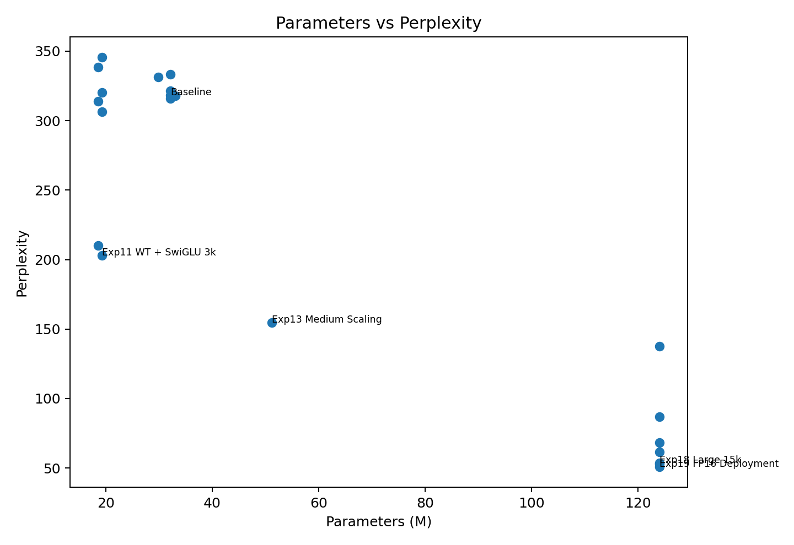
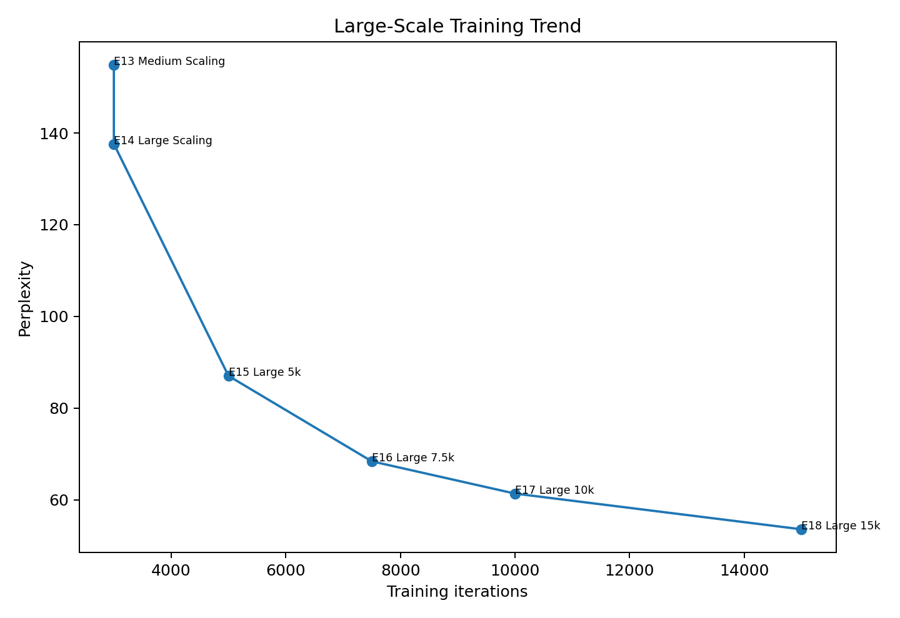
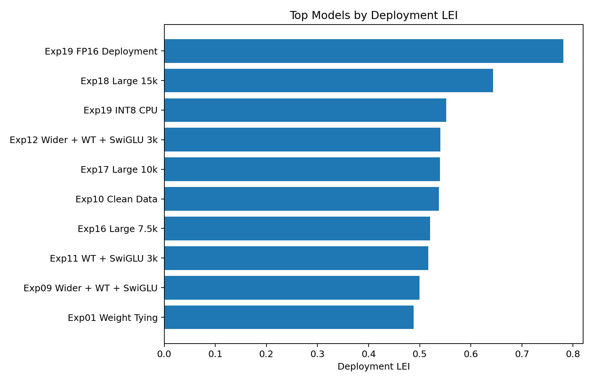

# Logos

A decoder-only transformer language model built from scratch in PyTorch — no `transformers`,
no pretrained weights — developed through a 21-experiment ablation study from a 32M-parameter
baseline to a 124M-parameter model, then benchmarked against GPT-2, Pythia, and SmolLM2.

The result worth reporting is not the model. It is that a systematically ablated 124M model
trained on a single workstation GPU serves inference **1.6× faster and in 2.3× less memory
than GPT-2 Small** at the same parameter count.

## What it produces

Prompt: *"The future of language models"* — Logos Exp18, temperature 0.9, top-k 40, top-p 0.9:

> The future of language models and the future of religion is not enough, but with the help of
> the public sector, the future of language models, and future of languages in the United States.
> The U.S. is looking to expand the world's ability to provide more information about the future
> of languages and the future of language models.

GPT-2 Small, same prompt and sampling settings:

> The future of language models is at stake. If we want to be able to make meaningful statements
> about what languages people choose to use, we need to understand and understand language models
> more carefully. Language models are inherently subjective and subjective, and it is possible
> that people will choose to use different languages and models than they did before.

Both are locally coherent and both loop. GPT-2 holds a thread across sentences noticeably better —
consistent with the ~40× training-token gap, not with any architectural difference.

## Efficiency vs. quality



Evaluated against four public models on identical held-out data, using **bits-per-byte** rather
than perplexity — the models do not share a tokenizer, which makes raw perplexity comparison
meaningless:

| Model | Params | bits/byte | ms/token | Peak VRAM |
|---|---|---|---|---|
| SmolLM2-135M | 134.5M | **1.005** | 59.6 | 3098 MB |
| Pythia-160M-deduped | 162.3M | 1.073 | 21.6 | 3054 MB |
| GPT-2 Small | 124.4M | 1.074 | 14.9 | 3099 MB |
| Pythia-70M-deduped | 70.4M | 1.219 | 11.5 | 2747 MB |
| **Logos Exp18** | 124.0M | 1.286 | **9.15** | **1372 MB** |

Logos places **last on quality and first on both latency and memory**. On a composite score
weighting quality against latency, memory, and model size, it ranks 2nd of 5 — behind
Pythia-70M, ahead of GPT-2 Small.

The quality gap is a compute gap. Logos saw ~245M tokens (15k steps × 16.4k tokens/step);
GPT-2 saw roughly 40× more. Validation loss was still descending at the final step:

| Step | 1k | 3k | 5k | 8k | 11k | 15k |
|---|---|---|---|---|---|---|
| Val perplexity | 250.0 | 108.3 | 77.8 | 63.1 | 55.5 | **53.6** |

## Findings

**Weight tying is the highest-leverage change in the study.** Tying `lm_head` to the token
embedding cut checkpoint size 40% (122 MB → 73 MB) for a 0.001 change in validation loss.
Carried into every subsequent experiment.

**SwiGLU was the only activation/norm change that helped.** Against the baseline's 318.4
perplexity: SwiGLU 315.9, RMSNorm 321.2 (neutral), GELU 333.3 (worse). Only SwiGLU and weight
tying were carried forward — the final model uses standard LayerNorm.

**FP16 is strictly better than the FP32 model it came from.** Lower validation loss
(3.930 vs 3.993), 34% smaller on disk, 9% less VRAM, marginally faster. It tops the deployment
efficiency index. Dynamic INT8 on CPU compressed further (267 MB) at 2.2× the latency.

**Scaling was compute-bound, not capacity-bound.** At fixed 124M parameters, extending training
from 3k to 15k steps moved perplexity 137.6 → 53.6 with no architecture change at all.



## Experiment ladder

Perplexities are comparable **within** each group but not across them — the groups use different
dataset pulls, so their validation sets differ.

**Group A — 10k-document pull, 1.5k steps** (context 256 unless noted)

| # | Experiment | Params | Perplexity |
|---|---|---|---|
| 00 | Baseline (control) | 32.2M | 318.4 |
| 01 | Weight tying | 19.2M | 320.3 |
| 02 | GELU activation | 32.2M | 333.3 |
| 03 | RMSNorm | 32.2M | 321.2 |
| 04 | SwiGLU FFN | 32.2M | 315.9 |
| 05 | Weight tying + SwiGLU | 19.2M | **306.4** |
| 06 | + 512 context | 19.3M | 345.4 |
| 07 | Deeper / narrower | 29.9M | 331.3 |
| 08 | Wider / shallower | 33.1M | 318.0 |
| 09 | Wider + WT + SwiGLU | 18.5M | 313.9 |
| 10 | Clean-data filtering | 18.5M | 338.5 |
| 11 | WT + SwiGLU, 3k steps | 19.2M | 202.8 |
| 12 | Wider + WT + SwiGLU, 3k steps | 18.5M | 210.0 |

Experiments 11–12 use 3k steps rather than 1.5k, so they are not comparable to 00–10 either.

**Group B — scaling, context 512**

| # | Experiment | Params | Docs | Steps | Perplexity |
|---|---|---|---|---|---|
| 13 | Medium scaling | 51.2M | 50k | 3k | 154.8 |
| 14 | Large scaling | 124.0M | 100k | 3k | 137.6 |
| 15 | Large, 5k steps | 124.0M | 100k | 5k | 87.0 |
| 16 | Large, 7.5k steps | 124.0M | 100k | 7.5k | 68.4 |
| 17 | Large, 10k steps | 124.0M | 100k | 10k | 61.4 |
| 18 | Large, 15k steps | 124.0M | 100k | 15k | **53.6** |

Experiments 19 (quantization), 20 (efficiency index), and 21 (public-model comparison) are
analyses of the Exp18 checkpoint rather than new training runs.

## Final architecture (Exp18)

```
Decoder-only transformer      12 layers x 12 heads x 768 dim (head_dim 64)
Context length                512
FFN                           SwiGLU, hidden 2048
Normalization                 LayerNorm (pre-norm)
Weight tying                  lm_head tied to token embedding
Parameters                    124,031,232
Tokenizer                     tiktoken GPT-2 (50257 vocab)
Dataset                       OpenWebText subset, 100k documents
Optimizer                     AdamW, lr 3e-4, wd 0.1, grad clip 1.0
Schedule                      400-step warmup, cosine decay to 5% of peak
Training                      15,000 steps, batch 32, 16,384 tokens/step
Precision                     AMP float16 with GradScaler
Final val loss                3.981  (perplexity 53.57)
Cost                          3,408 s wall clock, ~277 Wh measured GPU energy
```

Attention uses `F.scaled_dot_product_attention(..., is_causal=True)`. Sampling supports
temperature, top-k, and nucleus (top-p).

## The efficiency index

Experiment 20 scores every run on quality against checkpoint size, peak VRAM, inference latency,
measured GPU energy, and parameter count. Three variants are reported — deployment-weighted,
training-aware, and a simple ratio — because a model that is cheap to serve is not necessarily
cheap to train, and collapsing both into one number hides that.



Methodology and per-experiment scores:
[`reports/Logos_Experiment_20_Efficiency_Index_Report.pdf`](reports/Logos_Experiment_20_Efficiency_Index_Report.pdf),
[`results/exp20_efficiency_index_corrected.csv`](results/exp20_efficiency_index_corrected.csv).

## Repository layout

```
notebooks/    22 notebooks, one per experiment, run top to bottom
reports/      Per-experiment PDF write-ups and the final leaderboard
results/      Training curves, run configs, and benchmark data (CSV / JSON)
figures/      Charts from the efficiency index analysis
```

Notebooks retain their executed outputs, so every result above is readable without a GPU.

## Running it

```bash
pip install -r requirements.txt
jupyter lab notebooks/
```

Each notebook is self-contained: downloads its data slice, trains, evaluates, writes a summary.
Experiments 19–21 depend on the Exp18 checkpoint, so run `exp18` first or download the
released weights.

Developed on a single NVIDIA RTX 6000 Ada (48 GB). Exp18 peaks at 17.7 GB; the Group A
ablations fit in about 11 GB.

## Checkpoints

Weights are not stored in this repository. The Exp18 checkpoint (473 MB) and its FP16 variant
(310 MB) are published under Releases.

## Methodology caveats

**Validation splits are not random holdouts.** Each run uses the trailing 10% of a streamed,
unshuffled corpus pull. If document topics drift across the stream, validation loss measures
generalization to *later* documents rather than to a random sample. Adequate for comparing runs
from the same pull; not for absolute claims.

**Perplexity is not comparable across dataset pulls.** Hence the split ladder tables above.

**Cross-model comparison uses bits-per-byte,** because Logos, GPT-2, Pythia, and SmolLM2 use
different tokenizers and per-token perplexity is not a common unit across them.

Known code-level issues — checkpoint loading safety, a duplicated benchmark path, and an
interaction between INT8 quantization and weight tying — are documented in
[`Logos_Code_Review.md`](Logos_Code_Review.md).

## License

MIT — see [LICENSE](LICENSE).
